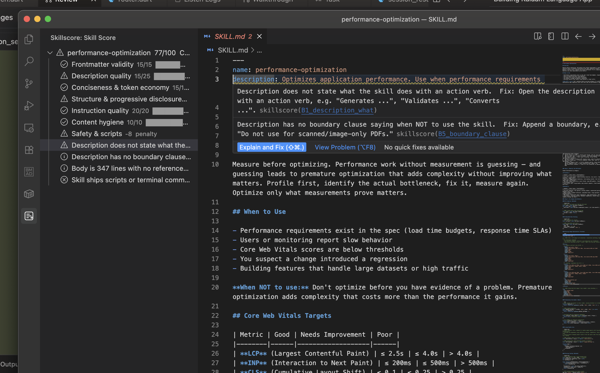

# Skillscore — SKILL.md Linter & Scorer

[](https://marketplace.visualstudio.com/items?itemName=sayed-ali-alkamel.skillscore)
[](https://open-vsx.org/extension/sayed-ali-alkamel/skillscore)
[](LICENSE)

Score and lint any [SKILL.md](https://github.com/sayed3li97/skillscore) file against the official authoring guides for Claude Code, Codex, and Antigravity — without leaving your editor.


---

## Features

**Inline diagnostics** — squiggly underlines on every failing rule with a rule ID, fix hint, and "Explain and Fix" lightbulb.

**Score panel** — sidebar tree showing all 7 rubric categories with progress bars, point totals, and a 0-100 / A-F grade.

**Status bar** — live `Skillscore: 84/100  B` indicator; turns red when the score drops below your configured threshold.

**Auto-scores** — triggers on open and save (600 ms debounce). No manual steps required.

**Multi-target ruleset** — choose Universal (all rules), Claude Code, Codex, or Antigravity to score against the guide that matters for your deployment.



---

## Requirements

The extension shells out to the [skillscore CLI](https://pub.dev/packages/skillscore). You need one of these on the machine:

| Method | Command |
|---|---|
| Dart pub global | `dart pub global activate skillscore` |
| Pre-built binary | Download from [Releases](https://github.com/sayed3li97/skillscore/releases) and set `skillscore.executablePath` |

The extension searches for the binary in this order:
1. `skillscore.executablePath` setting (if set)
2. Bundled platform binary (included in the VSIX for supported platforms)
3. `~/.pub-cache/bin/skillscore` (Dart pub global install)
4. `skillscore` on system `PATH`

---

## Installation

**VS Code / Cursor / Windsurf**

```
ext install sayed-ali-alkamel.skillscore
```

**Antigravity IDE / VSCodium (Open VSX)**

Search for `skillscore` in Extensions or install from [open-vsx.org](https://open-vsx.org/extension/sayed-ali-alkamel/skillscore).

---

## Usage

1. Open any folder that contains a `SKILL.md` file — the extension activates automatically.
2. Open `SKILL.md`. The status bar shows the current score and grade within a second.
3. Hover a squiggly underline to see the finding message, fix hint, and rule ID.
4. Click a finding in the **Skillscore** sidebar panel to jump directly to the flagged line.
5. Click `$(symbol-ruler)` in the editor title bar to re-score at any time.

---

## Configuration

| Setting | Default | Description |
|---|---|---|
| `skillscore.executablePath` | `""` | Absolute path to the skillscore binary. Leave empty to use the bundled binary, pub-cache, or system PATH. |
| `skillscore.target` | `"universal"` | Ruleset to score against: `universal`, `claude`, `codex`, or `antigravity`. |
| `skillscore.autoScore` | `true` | Automatically score SKILL.md on open and save. |
| `skillscore.minScore` | `0` | Status-bar warning threshold (0-100). The indicator turns red when the score falls below this value. |

---

## Commands

| Command | When available | Description |
|---|---|---|
| `Skillscore: Score this skill` | SKILL.md is the active editor | Manually trigger a score run. |

---

## Score breakdown

The rubric has 7 categories (total 100 points + safety penalty):

| Category | Max pts | What it checks |
|---|---|---|
| A — Frontmatter validity | 15 | name, description, tags present and well-formed |
| B — Description quality | 25 | action verb, boundary clause, scope accuracy |
| C — Conciseness & token economy | 15 | word count, duplication, prose density |
| D — Structure & progressive disclosure | 15 | heading hierarchy, examples, antipatterns section |
| E — Instruction quality | 20 | tool list, step clarity, specificity |
| F — Content hygiene | 10 | no dead links, no placeholder text |
| G — Safety & scripts | -8 penalty | safety section present; no raw shell scripts |

Scores map to grades A (90-100), B (80-89), C (70-79), D (60-69), F (< 60).

---

## Related

- [skillscore CLI](https://github.com/sayed3li97/skillscore) — the Dart CLI this extension wraps
- [pub.dev package](https://pub.dev/packages/skillscore) — install the CLI globally
- [Authoring guides](https://github.com/sayed3li97/skillscore#authoring-guides) — the rubrics each rule comes from

---

## License

Apache-2.0 — see [LICENSE](LICENSE).
